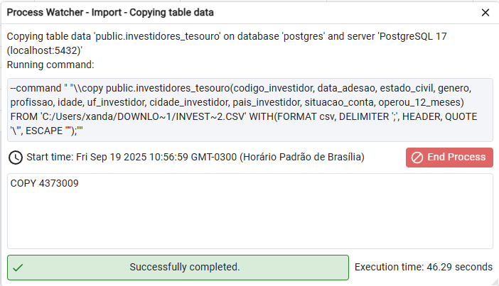
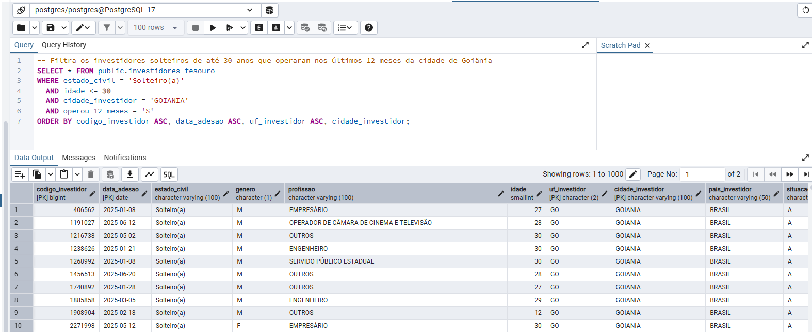
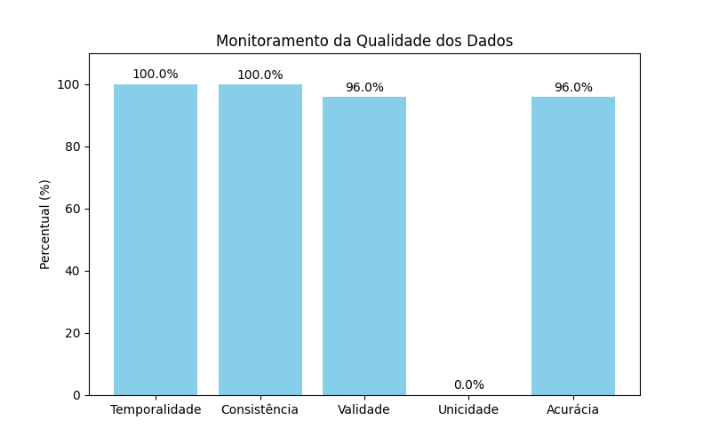

# Exercício 1 - Ciclo de Vida dos Dados

---
## Ciclo de Vida dos Dados
### Etapas importantes:

- Coleta → CSVs obtidos no 
- Armazenamento → PostgreSQL
- Processamento → Padronização de colunas e tipos
- Uso → Consultas SQL para análise
- Retenção/Descarte

---
## Pré-Processamento
Aqui é verificado a qualidade dos dados e aplicadas técnicas de remoção de duplicatas e filtragem de linhas por gênero (masculino ou feminino). O link da base de dados está disponível em: https://dados.gov.br/dados/conjuntos-dados/investidores-do-tesouro-direto.
Nome do conjunto de dados: Investidores do Tesouro Direto de 2025.

```python
import pandas as pd

# Carrega o CSV
df = pd.read_csv('C:/Users/xanda/Downloads/investidorestesourodireto2025.csv', sep=';')

# Filtra linhas onde 'Genero' é 'M' ou 'F'
df = df[df['Genero'].isin(['M', 'F'])]

# Remove duplicatas com base nas colunas equivalentes à chave primária
df = df.drop_duplicates(subset=[
    'Codigo do Investidor',
    'Data de Adesao',
    'UF do Investidor',
    'Cidade do Investidor'
])

# Salva um novo CSV limpo
df.to_csv('C:/Users/xanda/Downloads/investidores_limpo.csv', sep=';', index=False)
print("Arquivo limpo salvo com sucesso.")
```
---

## SQL
Use o script SQL abaixo para criar a tabela _investidores_tesouro_.

```sql
CREATE TABLE investidores_tesouro (
    codigo_investidor      BIGINT NOT NULL,
    data_adesao            DATE NOT NULL,
    estado_civil           VARCHAR(30),
    genero                 CHAR(1) CHECK (genero IN ('M', 'F')),
    profissao              VARCHAR(100),
    idade                  SMALLINT CHECK (idade >= 0),
    uf_investidor          CHAR(2),
    cidade_investidor      VARCHAR(100),
    pais_investidor        VARCHAR(50),
    situacao_conta         CHAR(1) CHECK (situacao_conta IN ('A', 'D')),
    operou_12_meses        CHAR(1) CHECK (operou_12_meses IN ('S', 'N')),
    PRIMARY KEY (codigo_investidor, data_adesao, uf_investidor, cidade_investidor)
);

```

---
## Inserção no banco de dados
A inserção no banco foi realizada usando a própria interface do pgAdmin (Import/Export).
1. Abra o pgAdmin e conecte-se ao seu servidor local.
2. Expanda o banco de dados desejado → Schemas → Tables.
3. Clique com o botão direito sobre a tabela onde os dados serão inseridos.
4. Selecione Import/Export Data.
5. Em Filename, escolha o caminho do seu arquivo investidores_limpo.csv.
6. Em Format escolha a opção CSV.
7. Header → marque que o CSV tem cabeçalho.
8. Delimiter → escolha a opção ";"
9. Clique em OK → os dados serão carregados na tabela.
---



## Exemplos de Consulta no banco de dados

```sql
-- Exibe as primeiras 10 linhas
SELECT * FROM public.investidores_tesouro
ORDER BY codigo_investidor ASC, data_adesao ASC, uf_investidor ASC, cidade_investidor ASC LIMIT 10;

-- Filtra os investidores solteiros de até 30 anos que operaram nos últimos 12 meses da cidade de Goiânia
SELECT * FROM public.investidores_tesouro
WHERE estado_civil = 'Solteiro(a)'
  AND idade <= 30 
  AND cidade_investidor = 'GOIANIA'
  AND operou_12_meses = 'S'
ORDER BY codigo_investidor ASC, data_adesao ASC, uf_investidor ASC, cidade_investidor;

-- Filtra os investidores homens casados maiores de 35 anos que não operaram nos últimos 12 meses da cidade de São Paulo
SELECT * FROM public.investidores_tesouro
WHERE estado_civil = 'Casado(a) com brasileiro(a) naturalizado(a)'
  AND idade  >= 35 
  AND cidade_investidor = 'SAO PAULO'
  AND operou_12_meses = 'N'
  AND genero = 'M'
ORDER BY codigo_investidor ASC, data_adesao ASC, uf_investidor ASC, cidade_investidor;


```



## Retenção e Descarte 

1. Retenção: manter apenas dados agregados (médias, distribuições).
2. Anonimização: remover identificadores pessoais antes de análises públicas.
3. Descarte: descartar registros brutos após período de uso em conformidade com a LGPD.

---
---

# Exercício 2 – Monitoramento Estratégico da Qualidade de Dados

Dimensões de Qualidade Monitoradas
Foram acompanhadas no mínimo 5 dimensões de qualidade, conforme boas práticas:
1. Temporalidade → verificar se as datas (ex: Data de Adesão) estão dentro de um período esperado, sem registros futuros ou inconsistentes.
2. Consistência → checar se dados relacionados estão coerentes (ex: UF e Cidade, situação da conta e operou 12 meses).
3. Validade → verificar se os dados seguem formatos ou regras esperadas (ex: idade ≥ 18, UF válido, datas corretas).
4. Unicidade → checar duplicatas (ex: Codigo do Investidor deve ser único; 0% indica que todos os códigos se repetem).
5. Acurácia → validar se os dados refletem a realidade esperada (ex: idade compatível com profissão ou limites plausíveis).

```python
import pandas as pd
import matplotlib.pyplot as plt

# Carregar o CSV (substitua pelo caminho real)
df = pd.read_csv("C:/Users/xanda/Downloads/investidores_limpo.csv", sep=";")

# ================================
# 1. Temporalidade 
# - Data de Adesão deve ser menor ou igual à data atual
# ================================
df['Data de Adesao'] = pd.to_datetime(df['Data de Adesao'], dayfirst=True, errors='coerce')
temporalidade = (df['Data de Adesao'] <= pd.Timestamp.today()).mean() * 100

# ================================
# 2. Consistência
# - Se "Operou 12 Meses" == 'S'
# ================================
df['consistencia'] = ~((df['Operou 12 Meses'] == 'S') & (df['Situacao da Conta'] == 'D'))
consistencia_percent = df['consistencia'].mean() * 100

# ================================
# 3. Validade
# - Idade >= 18
# - UF
# ================================
ufs_validas = ['AC','AL','AP','AM','BA','CE','DF','ES','GO','MA','MT',
               'MS','MG','PA','PB','PR','PE','PI','RJ','RN','RS','RO',
               'RR','SC','SP','SE','TO']
df['validade'] = (df['Idade'] >= 18) & (df['UF do Investidor'].isin(ufs_validas))
validade_percent = df['validade'].mean() * 100

# ================================
# 4. Unicidade
# ================================
unicidade_percent = df['Codigo do Investidor'].is_unique * 100

# ================================
# 5. Acurácia
# - Idade plausível (18–90)
# ================================
df['acuracia'] = df['Idade'].between(18, 90)
acuracia_percent = df['acuracia'].mean() * 100

# ================================
# Resumo em DataFrame
# ================================
qualidade = pd.DataFrame({
    'Dimensão': ['Temporalidade', 'Consistência', 'Validade', 'Unicidade', 'Acurácia'],
    'Percentual (%)': [
        temporalidade,
        consistencia_percent,
        validade_percent,
        unicidade_percent,
        acuracia_percent
    ]
})

print(qualidade)

# ================================
# Visualização com rótulos
# ================================
plt.figure(figsize=(8,5))
bars = plt.bar(qualidade['Dimensão'], qualidade['Percentual (%)'], color='skyblue')
plt.ylim(0, 110)
plt.title("Monitoramento da Qualidade dos Dados")
plt.ylabel("Percentual (%)")

# Inserir rótulos nas barras
for bar in bars:
    altura = bar.get_height()
    plt.text(bar.get_x() + bar.get_width()/2, altura + 1, 
             f"{altura:.1f}%", ha='center', va='bottom', fontsize=10)

plt.show()

```




## 📊 Resultado do Monitoramento de Qualidade dos Dados

## Sumário Executivo
A base apresenta **excelente temporalidade (100%)** e boa acurácia (≈95,95%), mas **sofre com problemas de unicidade (0%)**, indicando duplicidade total nos códigos dos investidores. A consistência e validade estão próximas do ideal (≈99,98% e ≈95,99%), mas merecem monitoramento contínuo, especialmente em relação às combinações de UF/Cidade e dados de idade.

**Principais riscos:**  
- **Duplicidade parcial** nos códigos dos investidores, comprometendo identificação única e análises confiáveis.  
- Pequenas inconsistências e dados potencialmente inválidos podem impactar decisões estratégicas.

---

## Tabela de KPIs

| Dimensão       | Valor (%)   | Status           |
|----------------|------------|----------------|
| Temporalidade  | 100.0      | ✅ Verde        |
| Consistência   | 99.98      | 🟡 Amarelo      |
| Validade       | 95.99      | 🟡 Amarelo      |
| Unicidade      | 0.0        | 🔴 Vermelho     |
| Acurácia       | 95.95      | 🟡 Amarelo      |

---

## Riscos & Impacto no Negócio
- **Decisões equivocadas:** duplicidade total nos códigos pode levar a análises incorretas de perfil de investidores.  
- **Relatórios imprecisos:** inconsistências e falhas de validade podem afetar dashboards estratégicos.  
- **Retrabalho operacional:** necessidade de limpar e consolidar registros duplicados consome recursos da equipe.

---

## Plano de Governança (próximas 2 semanas)
- Remoção de duplicatas e consolidação de registros – responsável: DBA.  
- Criação de regras automáticas de validação de idade, UF e cidade – responsável: Analista de Dados.  
- Documentação de regras de consistência e faixas aceitáveis de dados – responsável: Eng. de Dados.  
- Monitoramento contínuo de temporalidade e integridade de registros.

---

## Regras de Monitoramento Contínuo
- Alertar se duplicatas > 0,5%.  
- Alertar se valores fora de faixa ou inválidos > 1% em colunas críticas.  
- Alertar se inconsistências em relações UF/Cidade > 0,5%.

---

## Ética & Privacidade
- **Viés de gênero:** não identificado, mas deve ser monitorado.  
- **Anonimização:** aplicação de hash para dados sensíveis, como códigos de investidores.  
- **Transparência:** relatórios claros e periódicos sobre qualidade e integridade dos dados.

---

## Tecnologias Utilizadas
- **Python** para análise de qualidade de dados e visualização de KPIs.  
- **PostgreSQL** para armazenamento e manipulação do dataset.
