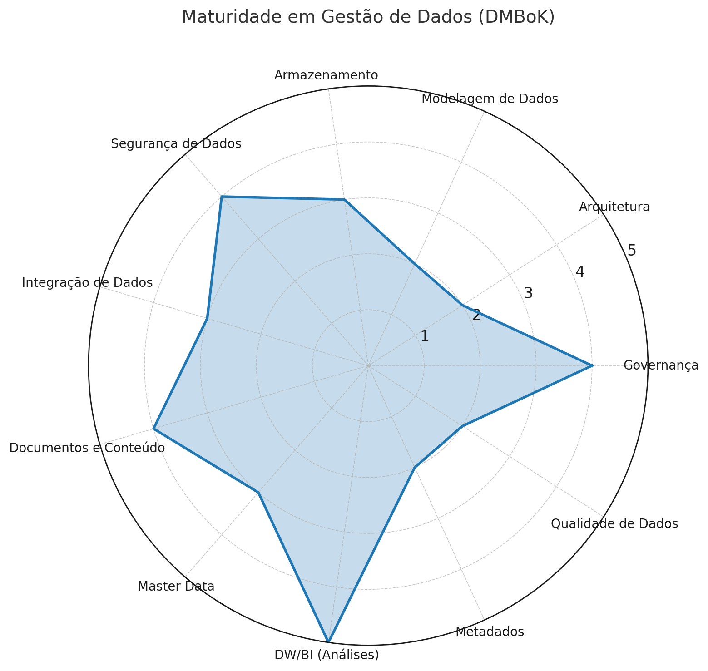

# Avaliação de Maturidade em Gestão de Dados - TJGO

## 📊 Sobre esta Avaliação

## Introdução

> ⚠️ **Aviso**: Este documento **não representa a visão oficial** do Tribunal de Justiça do Estado de Goiás (TJGO), **nem foi elaborado por pessoa vinculada à referida instituição.** Trata-se de um **exercício teórico e independente**, produzido com fins acadêmicos e exploratórios por alguém sem qualquer ligação com o TJGO.

Este material apresenta uma **simulação de autoavaliação de maturidade** em gestão de dados, com base nos domínios definidos pelo **DMBoK (Data Management Body of Knowledge)**.

Os dados aqui apresentados são **hipotéticos** e têm caráter exclusivamente ilustrativo.

### Escala de Maturidade

Cada área de gestão de dados é avaliada em uma escala de **1 a 5**, conforme os níveis abaixo:

- **1 - Inexistente**: Não existe gestão formal na área  
- **2 - Inicial**: Práticas básicas e não padronizadas  
- **3 - Definido**: Processos documentados e seguidos  
- **4 - Gerenciado**: Processos monitorados e controlados  
- **5 - Otimizado**: Melhoria contínua e excelência na execução

---

## 📋 Resultado da Avaliação - TJGO

| Domínio DMBoK | Nível | O que significa na prática |
|---------------|-------|---------------------------|
| **🏛️ Governança** | **4** | Existem regras claras sobre como usar os dados, com comissões responsáveis. Porém, nem todas as áreas seguem da mesma forma. |
| **🏗️ Arquitetura** | **2** | Cada sistema funciona de forma independente, sem uma visão geral integrada da organização. |
| **📐 Modelagem de Dados** | **2** | Os sistemas têm sua estrutura de dados, mas falta documentação padronizada sobre como os dados se relacionam. |
| **💾 Armazenamento** | **3** | Os dados ficam organizados em bancos de dados estruturados, mas ainda existem "ilhas" de informação separadas. |
| **🔒 Segurança de Dados** | **4** | Forte controle sobre sigilo judicial, senhas e proteção de dados pessoais (LGPD). Políticas bem estabelecidas. |
| **🔗 Integração de Dados** | **3** | Alguns sistemas "conversam" entre si (como com o CNJ), mas isso acontece caso a caso, sem padronização. |
| **📄 Documentos e Conteúdo** | **4** | Excelente gestão de documentos digitais, jurisprudência e assinaturas eletrônicas. Área bem desenvolvida. |
| **👥 Master Data** | **3** | Informações sobre pessoas e órgãos existem, mas a mesma entidade pode aparecer duplicada ou com nomes diferentes. |
| **📊 DW/BI (Relatórios)** | **5** | Painéis estatísticos públicos muito bem estruturados, mas ainda faltam análises que preveem o futuro. |
| **📝 Metadados** | **2** | Existem informações sobre os dados, mas cada sistema define as suas próprias regras, sem padronização. |
| **✅ Qualidade de Dados** | **2** | A precisão e completude dos dados varia entre sistemas. Há verificações, mas não centralizadas. |

---

## 📈 Gráfico de Maturidade (Visual)

### Pontuação Média: **3.1/5.0** - Nível **DEFINIDO**

---

## 🎯 Análise dos Resultados

### ✅ **Pontos Fortes (Níveis 4-5)**
- **Segurança**: Excelente controle de acesso e conformidade legal
- **Governança**: Estruturas formais bem estabelecidas
- **Documentos**: Gestão documental de excelência
- **Relatórios**: Painéis estatísticos de alta qualidade

### ⚠️ **Áreas de Atenção (Níveis 2-3)**
- **Arquitetura**: Sistemas funcionam isoladamente
- **Qualidade**: Dados inconsistentes entre sistemas
- **Metadados**: Falta padronização de informações sobre dados
- **Integração**: Conexões pontuais, não sistemáticas

### 🔴 **Oportunidades de Melhoria (Níveis 1-2)**
- **Modelagem**: Documentação e padrões de dados
- **Metadados**: Catálogo centralizado de dados
- **Qualidade**: Verificação centralizada e padronizada

---

## 🚀 Recomendações Prioritárias

### **🏆 ALTA PRIORIDADE**
1. **Criar um Catálogo de Dados**: Centralizar informações sobre onde estão e o que significam os dados
2. **Padronizar Master Data**: Unificar registros de pessoas e órgãos para evitar duplicações
3. **Implementar Governança de Qualidade**: Centralizar verificações de precisão dos dados

### **🔶 MÉDIA PRIORIDADE**
1. **Arquitetura de Dados Corporativa**: Criar visão integrada dos sistemas
2. **Padronizar Integrações**: Criar modelo único para sistemas "conversarem"
3. **Documentar Modelos de Dados**: Mapear como os dados se relacionam

### **🔸 BAIXA PRIORIDADE**
1. **Analytics Preditivo**: Expandir relatórios com previsões
2. **Automação de Qualidade**: Verificações automáticas de dados
3. **Self-Service Analytics**: Permitir que usuários criem próprios relatórios

---

## 📅 Plano de Evolução (12 meses)

### **Trimestre 1**: Fundação
- Criar catálogo de dados
- Definir padrões de qualidade
- Mapear sistemas existentes

### **Trimestre 2**: Integração
- Implementar MDM para pessoas/órgãos
- Padronizar integrações críticas
- Documentar arquitetura atual

### **Trimestre 3**: Qualidade
- Centralizar verificações de dados
- Implementar monitoramento contínuo
- Treinar equipes

### **Trimestre 4**: Otimização
- Analytics preditivo básico
- Automatizar processos
- Avaliar progresso

---

## 📊 Meta para Próxima Avaliação

| Domínio | Atual | Meta 12 meses |
|---------|-------|---------------|
| Arquitetura | 2 | 3 |
| Modelagem | 2 | 3 |
| Master Data | 3 | 4 |
| Integração | 3 | 4 |
| Metadados | 2 | 4 |
| Qualidade | 2 | 3 |

**Objetivo**: Elevar a média geral de **3.1** para **3.8** (Nível Gerenciado)

---

## 🎯 Indicadores de Sucesso

- **90%** dos dados críticos catalogados
- **95%** de precisão em dados de pessoas
- **Zero** duplicações em master data
- **100%** dos sistemas com documentação atualizada
- **24h** máximo para detectar problemas de qualidade

---
## 📚 Referências e Recursos

### Links Úteis
- [DMBoK v2 - Data Management Guide](https://www.dama.org/cpages/body-of-knowledge)
- [LGPD - Lei Geral de Proteção de Dados](https://www.planalto.gov.br/ccivil_03/_ato2015-2018/2018/lei/l13709.htm)
