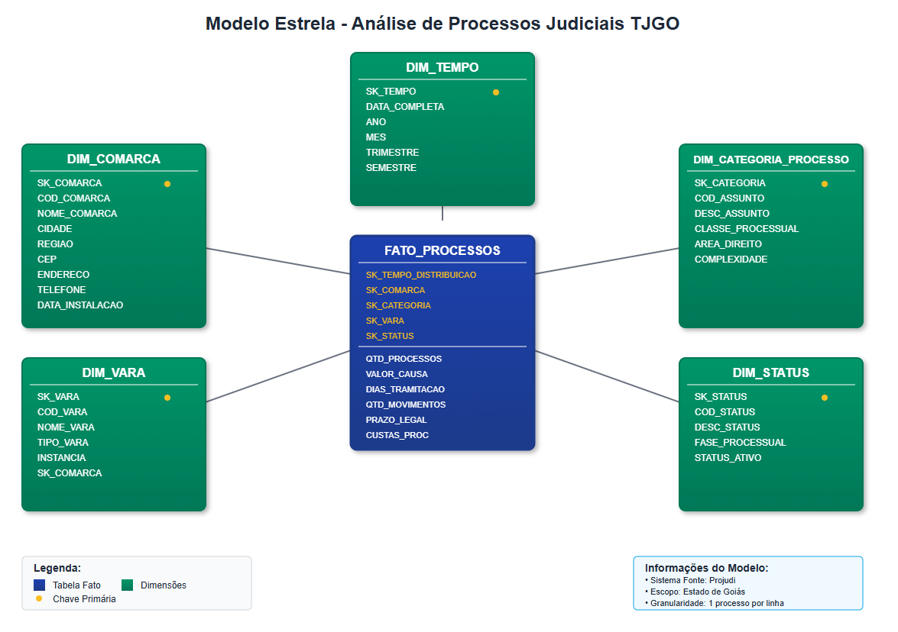

# Modelo Estrela - Análise de Processos Judiciais TJGO

> ⚠️ **Aviso**: Este documento **não representa a visão oficial** do Tribunal de Justiça do Estado de Goiás (TJGO), **nem foi elaborado por pessoa vinculada à referida instituição.** Trata-se de um **exercício teórico e independente**, produzido com fins acadêmicos e exploratórios por alguém sem qualquer ligação com o TJGO.

## Stack Tecnológica

- **Sistema Fonte**: Projudi (Sistema de Processo Judicial Digital)
- **Linguagem**: PostgreSQL
- **ETL**: Apache Airflow
- **Arquitetura de Dados**: Arquitetura Medalhão (Bronze, Silver, Gold)
- **Visualização**: Looker
- **Infraestrutura**: AWS Data Lake

## Cenário de Negócio

Este modelo dimensional foi desenvolvido para análise de processos judiciais do Tribunal de Justiça do Estado de Goiás, com foco na cidade de Goiânia. A solução permite análises por período, região e categoria de processo, fornecendo insights para gestão judiciária e tomada de decisões estratégicas.

## Arquitetura Medalhao

### Camada Bronze (Raw Data)
Dados extraídos diretamente do sistema Projudi sem transformações, mantendo a estrutura original das tabelas.

### Camada Silver (Cleaned Data)
Dados limpos, padronizados e com regras de qualidade aplicadas. Inclui validações de integridade e correção de inconsistências.

### Camada Gold (Business Data)
Modelo dimensional otimizado para análises de negócio. Contém as tabelas fato e dimensão apresentadas neste documento.

## Identificação de Fatos e Dimensões

### Tabela Fato Principal: `FATO_PROCESSOS`
**Granularidade**: Um registro por processo judicial

### Dimensões:
- **DIM_TEMPO**: Análises temporais
- **DIM_COMARCA**: Análises por localização geográfica
- **DIM_CATEGORIA_PROCESSO**: Análises por tipo e assunto
- **DIM_VARA**: Vara/juízo responsável
- **DIM_STATUS**: Situação processual

## Diagrama do Modelo Estrela



## Especificação das Dimensões

### DIM_TEMPO
| Atributo | Tipo | Descrição |
|----------|------|-----------|
| SK_TEMPO | INT | Chave surrogate |
| DATA_COMPLETA | DATE | Data no formato AAAA-MM-DD |
| ANO | INT | Ano  |
| MES | INT | Mês  |
| TRIMESTRE | INT | Trimestre  |
| SEMESTRE | INT | Semestre |

### DIM_COMARCA
| Atributo | Tipo | Descrição |
|----------|------|-----------|
| SK_COMARCA | INT | Chave surrogate |
| COD_COMARCA | VARCHAR(10) | Código CNJ |
| NOME_COMARCA | VARCHAR(100) | Nome da comarca |
| CIDADE | VARCHAR(50) | Cidade sede |
| REGIAO | VARCHAR(30) | Região (Capital, Interior) |
| CEP | VARCHAR(9) | CEP da comarca |
| ENDERECO | VARCHAR(200) | Endereço completo |
| TELEFONE | VARCHAR(20) | Telefone de contato |
| DATA_INSTALACAO | DATE | Data de instalação |

### DIM_CATEGORIA_PROCESSO
| Atributo | Tipo | Descrição |
|----------|------|-----------|
| SK_CATEGORIA | INT | Chave surrogate |
| COD_ASSUNTO | VARCHAR(20) | Código CNJ do assunto |
| DESC_ASSUNTO | VARCHAR(200) | Descrição do assunto |
| CLASSE_PROCESSUAL | VARCHAR(50) | Classe processual |
| AREA_DIREITO | VARCHAR(50) | Área do direito (Civil, Criminal, etc.) |
| COMPLEXIDADE | VARCHAR(20) | Baixa, Média, Alta |

### DIM_VARA
| Atributo | Tipo | Descrição |
|----------|------|-----------|
| SK_VARA | INT | Chave surrogate |
| COD_VARA | VARCHAR(20) | Código da vara |
| NOME_VARA | VARCHAR(100) | Nome da vara |
| TIPO_VARA | VARCHAR(50) | Tipo (Civil, Criminal, Família, etc.) |
| INSTANCIA | VARCHAR(20) | 1º Grau, 2º Grau |

### DIM_STATUS
| Atributo | Tipo | Descrição |
|----------|------|-----------|
| SK_STATUS | INT | Chave surrogate |
| COD_STATUS | VARCHAR(10) | Código do status |
| DESC_STATUS | VARCHAR(100) | Descrição do status |
| FASE_PROCESSUAL | VARCHAR(50) | Fase (Inicial, Instrução, etc.) |
| STATUS_ATIVO | BOOLEAN | Se o processo está ativo |

## Métricas da Tabela Fato

### FATO_PROCESSOS
| Métrica | Tipo | Descrição |
|---------|------|-----------|
| QTD_PROCESSOS | INT | Quantidade de processos |
| VALOR_CAUSA | DECIMAL(15,2) | Valor da causa em reais |
| DIAS_TRAMITACAO | INT | Dias desde a distribuição |
| QTD_MOVIMENTOS | INT | Quantidade de movimentações |
| PRAZO_LEGAL | INT | Prazo legal em dias |
| CUSTAS_PROC | DECIMAL(10,2) | Valor das custas |
| DIAS_PARALISADO | INT | Dias que o processo ficou parado |
| QTD_AUDIENCIAS | INT | Quantidade de audiências realizadas |
| VALOR_CONDENACAO | DECIMAL(15,2) | Valor da condenação (se houver) |

## DDL - Criação das Tabelas

```sql
-- =====================================================
-- GOLD LAYER - MODELO DIMENSIONAL
-- =====================================================
CREATE SCHEMA DW_TJGO_GOLD;
USE DW_TJGO_GOLD;

-- =====================================================
-- DIMENSÃO TEMPO
-- =====================================================
CREATE TABLE DIM_TEMPO (
    SK_TEMPO INT PRIMARY KEY AUTO_INCREMENT,
    DATA_COMPLETA DATE NOT NULL UNIQUE,
    ANO INT NOT NULL,
    MES INT NOT NULL,
    TRIMESTRE INT NOT NULL,
    SEMESTRE INT NOT NULL,
    DATA_CRIACAO TIMESTAMP DEFAULT CURRENT_TIMESTAMP
);

CREATE INDEX IDX_DIM_TEMPO_ANO ON DIM_TEMPO(ANO);
CREATE INDEX IDX_DIM_TEMPO_MES ON DIM_TEMPO(MES);
CREATE INDEX IDX_DIM_TEMPO_TRIMESTRE ON DIM_TEMPO(TRIMESTRE);

-- =====================================================
-- DIMENSÃO COMARCA
-- =====================================================
CREATE TABLE DIM_COMARCA (
    SK_COMARCA INT PRIMARY KEY AUTO_INCREMENT,
    COD_COMARCA VARCHAR(10) NOT NULL UNIQUE,
    NOME_COMARCA VARCHAR(100) NOT NULL,
    CIDADE VARCHAR(50) NOT NULL,
    REGIAO VARCHAR(30) NOT NULL,
    CEP VARCHAR(9),
    ENDERECO VARCHAR(200),
    TELEFONE VARCHAR(20),
    DATA_INSTALACAO DATE,
    ATIVO BOOLEAN DEFAULT TRUE,
    DATA_CRIACAO TIMESTAMP DEFAULT CURRENT_TIMESTAMP,
    DATA_ATUALIZACAO TIMESTAMP DEFAULT CURRENT_TIMESTAMP ON UPDATE CURRENT_TIMESTAMP
);

CREATE INDEX IDX_DIM_COMARCA_CIDADE ON DIM_COMARCA(CIDADE);
CREATE INDEX IDX_DIM_COMARCA_REGIAO ON DIM_COMARCA(REGIAO);

-- =====================================================
-- DIMENSÃO CATEGORIA PROCESSO
-- =====================================================
CREATE TABLE DIM_CATEGORIA_PROCESSO (
    SK_CATEGORIA INT PRIMARY KEY AUTO_INCREMENT,
    COD_ASSUNTO VARCHAR(20) NOT NULL UNIQUE,
    DESC_ASSUNTO VARCHAR(200) NOT NULL,
    CLASSE_PROCESSUAL VARCHAR(50) NOT NULL,
    AREA_DIREITO VARCHAR(50) NOT NULL,
    COMPLEXIDADE VARCHAR(20) NOT NULL,
    ATIVO BOOLEAN DEFAULT TRUE,
    DATA_CRIACAO TIMESTAMP DEFAULT CURRENT_TIMESTAMP,
    DATA_ATUALIZACAO TIMESTAMP DEFAULT CURRENT_TIMESTAMP ON UPDATE CURRENT_TIMESTAMP
);

CREATE INDEX IDX_DIM_CATEGORIA_AREA ON DIM_CATEGORIA_PROCESSO(AREA_DIREITO);
CREATE INDEX IDX_DIM_CATEGORIA_COMPLEXIDADE ON DIM_CATEGORIA_PROCESSO(COMPLEXIDADE);

-- =====================================================
-- DIMENSÃO VARA
-- =====================================================
CREATE TABLE DIM_VARA (
    SK_VARA INT PRIMARY KEY AUTO_INCREMENT,
    COD_VARA VARCHAR(20) NOT NULL UNIQUE,
    NOME_VARA VARCHAR(100) NOT NULL,
    TIPO_VARA VARCHAR(50) NOT NULL,
    INSTANCIA VARCHAR(20) NOT NULL,
    SK_COMARCA INT,
    ATIVO BOOLEAN DEFAULT TRUE,
    DATA_CRIACAO TIMESTAMP DEFAULT CURRENT_TIMESTAMP,
    DATA_ATUALIZACAO TIMESTAMP DEFAULT CURRENT_TIMESTAMP ON UPDATE CURRENT_TIMESTAMP,
    FOREIGN KEY (SK_COMARCA) REFERENCES DIM_COMARCA(SK_COMARCA)
);

CREATE INDEX IDX_DIM_VARA_TIPO ON DIM_VARA(TIPO_VARA);
CREATE INDEX IDX_DIM_VARA_INSTANCIA ON DIM_VARA(INSTANCIA);
CREATE INDEX IDX_DIM_VARA_COMARCA ON DIM_VARA(SK_COMARCA);

-- =====================================================
-- DIMENSÃO STATUS
-- =====================================================
CREATE TABLE DIM_STATUS (
    SK_STATUS INT PRIMARY KEY AUTO_INCREMENT,
    COD_STATUS VARCHAR(10) NOT NULL UNIQUE,
    DESC_STATUS VARCHAR(100) NOT NULL,
    FASE_PROCESSUAL VARCHAR(50) NOT NULL,
    STATUS_ATIVO BOOLEAN DEFAULT TRUE,
    DATA_CRIACAO TIMESTAMP DEFAULT CURRENT_TIMESTAMP,
    DATA_ATUALIZACAO TIMESTAMP DEFAULT CURRENT_TIMESTAMP ON UPDATE CURRENT_TIMESTAMP
);

CREATE INDEX IDX_DIM_STATUS_FASE ON DIM_STATUS(FASE_PROCESSUAL);

-- =====================================================
-- TABELA FATO PROCESSOS
-- =====================================================
CREATE TABLE FATO_PROCESSOS (
    SK_FATO_PROCESSO BIGINT PRIMARY KEY AUTO_INCREMENT,
    
    -- Chaves estrangeiras das dimensões
    SK_TEMPO_DISTRIBUICAO INT NOT NULL,
    SK_TEMPO_ULTIMO_MOV INT,
    SK_COMARCA INT NOT NULL,
    SK_CATEGORIA INT NOT NULL,
    SK_VARA INT NOT NULL,
    SK_STATUS INT NOT NULL,
    
    -- Chaves de negócio
    NUM_PROCESSO VARCHAR(25) NOT NULL UNIQUE,
    NUM_PROCESSO_ORIGEM VARCHAR(20),
    
    -- Métricas
    QTD_PROCESSOS INT DEFAULT 1,
    VALOR_CAUSA DECIMAL(15,2) DEFAULT 0,
    DIAS_TRAMITACAO INT DEFAULT 0,
    QTD_MOVIMENTOS INT DEFAULT 0,
    PRAZO_LEGAL INT,
    CUSTAS_PROC DECIMAL(10,2) DEFAULT 0,
    DIAS_PARALISADO INT DEFAULT 0,
    QTD_AUDIENCIAS INT DEFAULT 0,
    VALOR_CONDENACAO DECIMAL(15,2) DEFAULT 0,
    
    -- Controle de qualidade
    DATA_CARGA TIMESTAMP DEFAULT CURRENT_TIMESTAMP,
    FONTE_DADOS VARCHAR(50) DEFAULT 'PROJUDI',
    
    -- Chaves estrangeiras
    FOREIGN KEY (SK_TEMPO_DISTRIBUICAO) REFERENCES DIM_TEMPO(SK_TEMPO),
    FOREIGN KEY (SK_TEMPO_ULTIMO_MOV) REFERENCES DIM_TEMPO(SK_TEMPO),
    FOREIGN KEY (SK_COMARCA) REFERENCES DIM_COMARCA(SK_COMARCA),
    FOREIGN KEY (SK_CATEGORIA) REFERENCES DIM_CATEGORIA_PROCESSO(SK_CATEGORIA),
    FOREIGN KEY (SK_VARA) REFERENCES DIM_VARA(SK_VARA),
    FOREIGN KEY (SK_STATUS) REFERENCES DIM_STATUS(SK_STATUS)
);

-- Índices da tabela fato
CREATE INDEX IDX_FATO_TEMPO_DIST ON FATO_PROCESSOS(SK_TEMPO_DISTRIBUICAO);
CREATE INDEX IDX_FATO_COMARCA ON FATO_PROCESSOS(SK_COMARCA);
CREATE INDEX IDX_FATO_CATEGORIA ON FATO_PROCESSOS(SK_CATEGORIA);
CREATE INDEX IDX_FATO_VARA ON FATO_PROCESSOS(SK_VARA);
CREATE INDEX IDX_FATO_STATUS ON FATO_PROCESSOS(SK_STATUS);
CREATE INDEX IDX_FATO_NUM_PROCESSO ON FATO_PROCESSOS(NUM_PROCESSO);
CREATE INDEX IDX_FATO_DATA_CARGA ON FATO_PROCESSOS(DATA_CARGA);

-- Índice composto para consultas frequentes
CREATE INDEX IDX_FATO_TEMPO_COMARCA_CATEGORIA 
ON FATO_PROCESSOS(SK_TEMPO_DISTRIBUICAO, SK_COMARCA, SK_CATEGORIA);
```

## Exemplos de Análises

### Por Período
- Processos distribuídos por mês/trimestre/ano
- Tempo médio de tramitação por período

### Por Região
- Distribuição de processos por comarca
- Eficiência por região geográfica

### Por Categoria
- Ranking dos assuntos mais demandados
- Tempo de tramitação por tipo de processo
- Valor médio das causas por categoria
- Taxa de congestionamento por área do direito

## Indicadores-Chave (KPIs)

1. **Taxa de Congestionamento**: (Processos Pendentes) / (Processos Novos + Processos Resolvidos)
2. **Tempo Médio de Tramitação**: Média de dias entre distribuição e baixa
3. **Produtividade por Vara**: Processos julgados / Quantidade de varas
4. **Índice de Atendimento ao Prazo**: Processos dentro do prazo / Total de processos
5. **Valor Médio das Causas**: Soma dos valores / Quantidade de processos

## Processo ETL

### Extração
- **Sistema Fonte**: Projudi
- **Frequência**: Diária para dados transacionais
- **Método**: Conexão direta via API/ODBC
- **Validação**: Integridade referencial e regras de negócio

### Transformação
- **Limpeza**: Padronização de nomes e códigos
- **Enriquecimento**: Cálculo de métricas derivadas
- **Historização**: Controle de mudanças nas dimensões SCD Tipo 2

### Carga
- **Estratégia**: Incremental para tabela fato / Full refresh para dimensões
- **Janela de Processamento**: Horário noturno das 23h às 6h
- **Validação**: Testes de qualidade de dados pós-carga
- **Monitoramento**: Logs de execução e alertas por email

## Benefícios Esperados

1. **Visibilidade Executiva**: Dashboards gerenciais em tempo real
2. **Identificação de Gargalos**: Análise de eficiência operacional
3. **Transparência Pública**: Relatórios automatizados para sociedade
4. **Planejamento Estratégico**: Previsão de demanda e alocação de recursos
5. **Conformidade Regulatória**: Atendimento às metas do CNJ

## Considerações Técnicas

- Implementação de particionamento por ano na tabela fato para otimização de performance
- Uso de índices bitmap para consultas analíticas em ambientes OLAP
- Configuração de retenção de dados conforme políticas institucionais
- Implementação de disaster recovery com backup incremental diário
- Monitoramento de performance com alertas automáticos para consultas lentas
